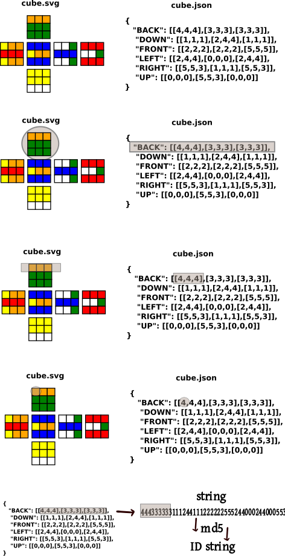
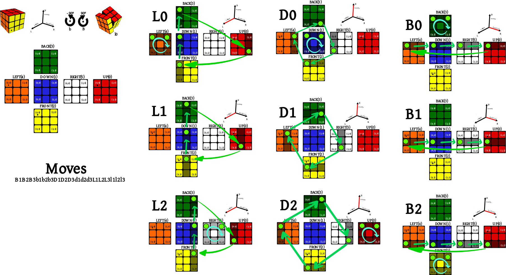

[![uclm](https://img.shields.io/badge/uclm-esi-red.svg?logo=data:image/png;base64,iVBORw0KGgoAAAANSUhEUgAAAA8AAAAPCAYAAAA71pVKAAAC9UlEQVR42o3S3UtTYRwH8F//QhBE3WT0elGr6CZUCLzoRUQt6ibICrESS1MDi7pJwcSXgsCGlG+1LFFzzpzONqduTp3TqVO36V7OzubZ2TznbDvn7NW5nmlXWdADPzg8/D6c3/N9HohSDPCrDgg53bDJByERj0OEpCCEE8cjXlrJaBbOcys2iHpp1OOBgN4MaG/b/BXHfKxgkwuaNvkQE6X8WNDiTI16qP/AicTlMElPeeXTtdTY7G1Kpa/iLU5dnONvhHDyH9hBJGEGu2RV2t93PWaXrb2xAO/kTJgMb5EUM9MGWZQJ5PrnTH9gMwYx2n865PLOrr5uK+XXcLV/YfUD3t5fFFgwN0Y89JzlTUcxb3PNc2YsjVHrdzAKBX1gh+KhsIXokgtJqbopxvIvEa7y600i38xSnXd4qpwa1zcTvcqGqNdHMBPzpzijHSDGcic2WV4Xj0QTGwptBd4meejTGb+gKcS+acMD1mj7Ro3OfcWE3fddnbJnKMRExMuYglbXWUCjjCTQitEBu2dQU05rFp6gsOrJftXzqI9d8gxpajzDk9XUqK6MVs+Xx9igLtnPmewz4GiRnEFprmxtbSXWO4crUCgVrs7hfDTyeLIpiBG29a6fBTxGlPkX116grQBrwnBHq+QCOD9LwflpQIDSNVAjM8IQSVWQfWN1lgZRQRLjH8WF7h5FJW9brww63I2c2WG0N/WkOUVSAHJADZ6BCXAIu/eiP9ehs79Do97xzxrbk5hdsYo9UlVejAnU0lOGFnvT932ubsW2A01WMUxml8Bo2l3QZD7ai+6wnLc5XyGnSuyslTC5UYOOUTJz/enBifR80GaXgjanDGAoJRMGU67Cj/0ZMJZ+DyzVrYdplT4PocXf2B4wWIrwVslJzcUCkB+4AiNHc1HlAMgFN7dr6EgWqC8VgrVeBI7mPkBPUZuUYfeGlehR7HGhbKYzi0F57BqMn7uVrN3Y9rYD0HMEontE4NMuK7yyyVS3WAmujqFd+Bcdh3NlWlsAggAAAABJRU5ErkJggg==&longCache=true&colorA=b30135&colorB=555555&style=for-the-badge)](https://www.esi.uclm.es)
# Laboratorio de Sistemas Inteligentes 2019/2020
## Participantes
Mario Pérez Sánchez-Montañez (mapecode)  
David Camuñas Sánchez (dcamunas)  
Sara Lara Caro (Sara-Lara)  

## Objetivo
Resolver un cubo de rubik de NxN aplicando los siguientes algoritmos de búsqueda:
* [Búsqueda en anchura](https://es.wikipedia.org/wiki/Búsqueda_en_anchura)
* [Búsqueda de costo uniforme](https://es.wikipedia.org/wiki/Búsqueda_de_costo_uniforme)
* [Búsqueda en profundidad simple](https://es.wikipedia.org/wiki/Búsqueda_en_profundidad)
* [Búsqueda en profundidad limitada](https://es.wikipedia.org/wiki/Búsqueda_en_profundidad_limitada)
* [Búsqueda en profundidad iterativa](https://es.wikipedia.org/wiki/Búsqueda_en_profundidad_iterativa)
* [Búsqueda A*](https://es.wikipedia.org/wiki/Algoritmo_de_búsqueda_A*)
* [Búsqueda Voraz](https://es.wikipedia.org/wiki/Algoritmo_voraz)

## Nomenclatura utilizada
La representación de las caras del cubo y su correspondencia con el fichero de entrada JSON se pueden apreciar en la siguiente imagen:

Los movimientos que se aplicarán al cubo están representados en la siguiente imagen:

## Requerimientos
* Python versión 3.x
* Librería numpy: **pip3 install numpy**

## Ejecución
python3 rubik.py <max_depth> <depth_increment> <strategy> <cube.json>

Si la ejecución es exitosa se observará la secuencia de acciones que se han aplicado para resolver el cubo. Esta secuencia de acciones quedará guardada en un fichero llamado __solution.txt__.

